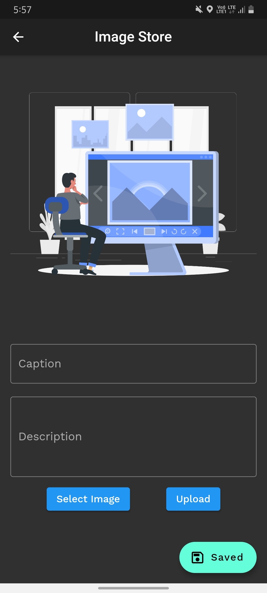
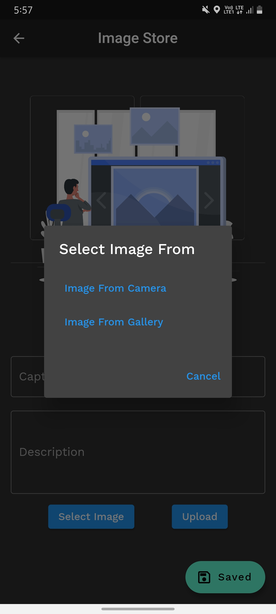
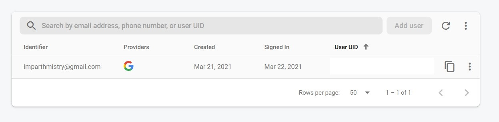
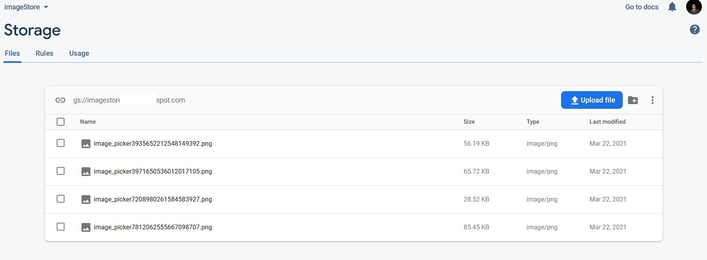
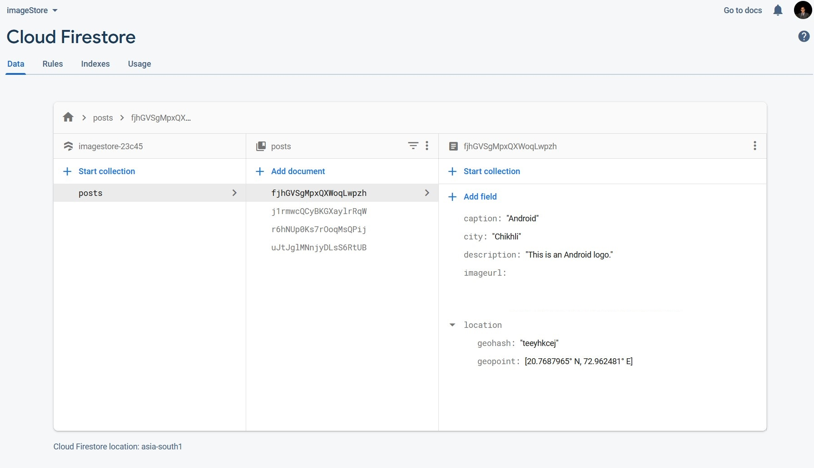

# Image Store
>by Ravshan Khamidov

* It is an application which is built on Flutter to store Images in Cloud on Firebase FireStore.
* The user need to login using the Google ID to do the following tasks.
---
## Flow Of The Application:
1. User will log in using Google credentials.
2. Home screen of the app will open after the logging in.
3. Here the user will write the caption of the image, description and select the image eiether from the camera or from the gallery.
4. There is a floating action button saying saved images. It will return all the images along with their location and description and caption in a list.
## Screens:  
<table>
    <tr>
        <td> </td>
        <td> </td>
        <td> </td>
    </tr>
  </table>
  
   
  
  ## Screens DB: 
  Firebas
  
  <table>
    <tr>
        <td colspan=4> </td>
    </tr>
    <tr><td colspan=4> </td></tr>
    <tr><td colspan=4> </td></tr>
</table>
